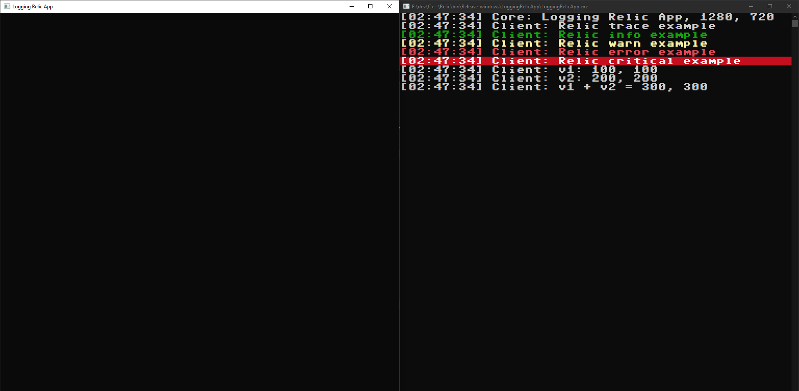

# Relic Game Engine
Relic is a small, cross platform, 2d game engine developed in C++14 with sfml for handeling window events and rendering.
Relic is currently supported for Windows and Linux.

Magnus Ahlstromer V (mahlstromerv@gmail.com)

# How to build Windows
    1) git clone --recursive git@github.com:therealmagnesium/Relic.git
    2) cd Relic
    3) chmod +x build.sh
    4) ./build.sh windows (config)
    5) open bin folder and run some example apps!
    + config:
        - debug
        - release
        - dist

# How to build Linux
    1) git clone --recursive git@github.com:therealmagnesium/Relic.git
    2) cd Relic
    3) chmod +x build.sh vendor/linux/premake5
    4) ./build.sh linux (config)
    5) open bin folder and run some example apps!
    + config:
        - debug
        - release
        - dist

# Screenshots

