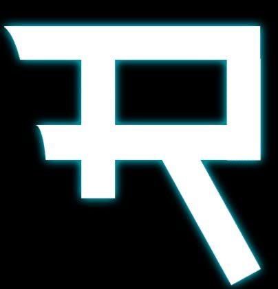
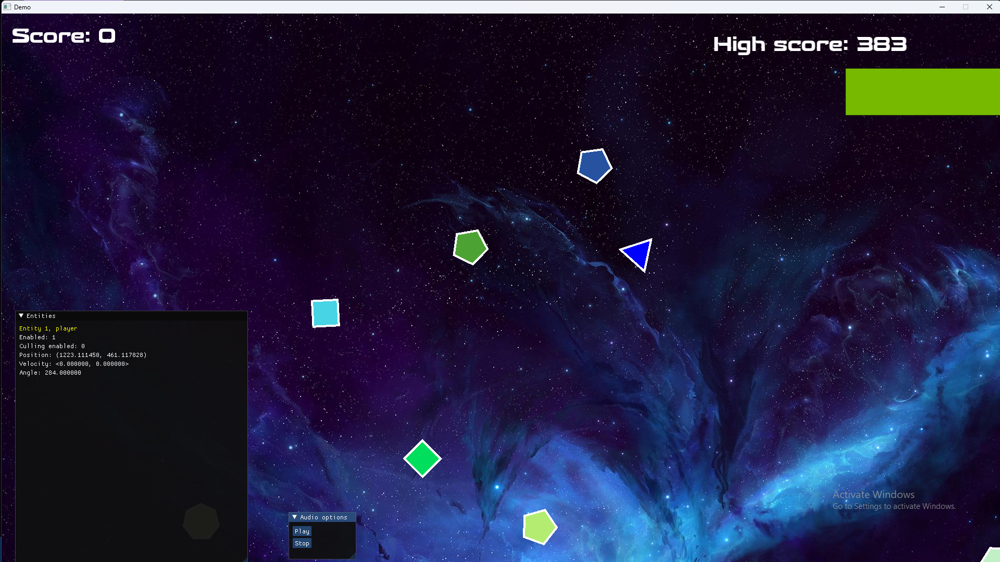

# Relic Game Engine

Relic is a small, cross platform, 2d game engine developed in C++17 with sfml for handeling window events and rendering.
Relic is currently supported for Windows and Linux and currently has two sample projects.
In the Examples folder, there is a game called 'ShapeShooterz' and a basic project to start logging.

Magnus Ahlstromer V (mahlstromerv@gmail.com)

# How to build Windows
    1) git clone --recursive git@github.com:therealmagnesium/Relic.git
    2) cd Relic
    3) chmod +x build.sh
    4) ./build.sh windows (config)
    5) copy assets and data folder from Example projects to the folder with the executable
    6) copy dlls in vendor/windows/bin to folder with executable
    7) run some example apps from the bin folder!
    + config:
        - debug
        - release
        - dist

# How to build Linux
    1) git clone --recursive git@github.com:therealmagnesium/Relic.git
    2) cd Relic
    3) chmod +x build.sh vendor/linux/premake5
    4) ./build.sh linux (config) 
    5) copy assets and data folder from Example projects to the folder with the executable
    6) open bin folder and run some example apps!
    + config:
        - debug
        - release
        - dist

# Screenshot of Shape Shooterz

# Special Thanks
    + John Tagliaferri
        - Designed Relic logo
        - Came up with 'ShapeShooterz' title
