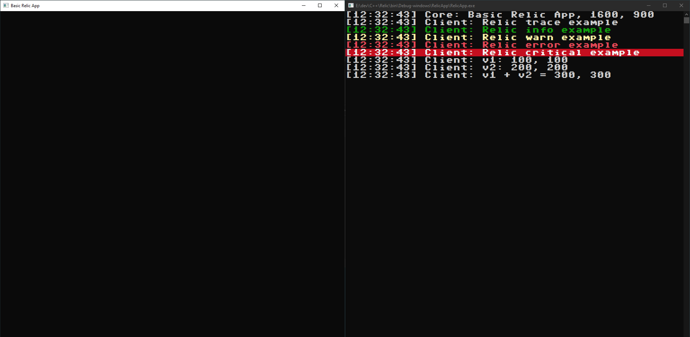

# Relic Game Engine
Relic is a small, cross platform, 2d game engine developed in C++14 with sfml for handeling window events and rendering.
Relic is currently supported for Windows and Linux.

Magnus Ahlstromer V (mahlstromerv@gmail.com)

# How to build
    1) git clone --recursive git@github.com:therealmagnesium/Relic.git
    2) cd Relic
    3) ./build.sh (system) (type)
    4) Open bin folder and run some example apps!
    + system:
        - windows
        - linux
    + type:
        - debug
        - release
        - dist

# Screenshots

